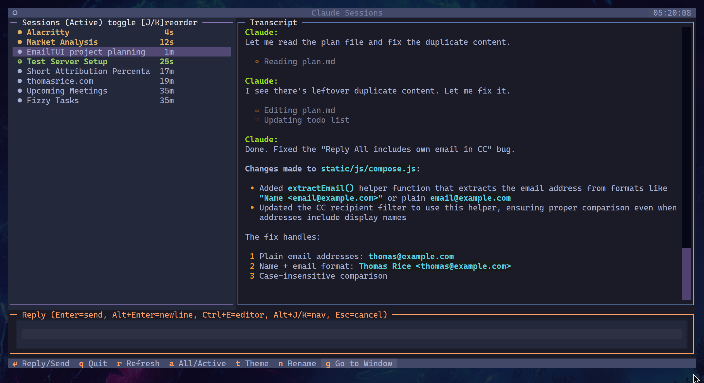

# Claude Sessions

A dashboard TUI for viewing and interacting with your running Claude Code sessions.



- **Multi-project** - works across independent directories, each with their own `CLAUDE.md`
- **Lightweight** - single Python file, no dependencies beyond Textual
- **Non-invasive** - doesn't launch or manage sessions, just observes and interacts
- **Tiled WM native** - built for Hyprland workspaces

Built for [Omarchy](https://omarchy.org).

## Author

- Thomas Rice
- [@thomasrice_au](https://x.com/thomasrice_au)
- [www.thomasrice.com](https://www.thomasrice.com/)

## Features

- **View transcripts** - Read the full conversation history for any session
- **Send messages** - Reply to sessions directly (types into the target terminal window)
- **Session overview** - See all active sessions with status indicators
- **Working indicator** - Animated spinner shows when Claude is processing
- **Unread markers** - Highlights sessions with new activity since you last viewed
- **Custom names** - Label sessions for easy identification
- **Theme support** - Cycle through Textual's built-in themes

## Requirements

- [Omarchy](https://omarchy.org) or equivalent Hyprland setup
- Python 3.11+ with [uv](https://github.com/astral-sh/uv)
- `wtype` (for typing into windows)
- `jq` (for the hook script)

## Installation

1. **Copy the main script** to somewhere in your PATH:

```bash
cp claude-sessions ~/bin/
chmod +x ~/bin/claude-sessions
```

2. **Install the session tracking hook** for accurate window matching:

```bash
mkdir -p ~/.claude/hooks
cp hooks/track-session-pid.sh ~/.claude/hooks/
chmod +x ~/.claude/hooks/track-session-pid.sh
```

3. **Configure Claude to use the hook** by adding to `~/.claude/settings.json`:

```json
{
  "hooks": {
    "SessionStart": [
      {
        "hooks": [
          {
            "type": "command",
            "command": "~/.claude/hooks/track-session-pid.sh"
          }
        ]
      }
    ]
  }
}
```

## Usage

```bash
claude-sessions
```

### Keybindings

| Key | Action |
|-----|--------|
| `j/k` | Navigate sessions |
| `Enter` | Focus reply input / Send message |
| `Alt+Enter` | Insert newline in reply |
| `Ctrl+E` | Edit reply in $EDITOR |
| `Escape` | Cancel reply |
| `g` | Go to session window |
| `n` | Rename session |
| `a` | Toggle all/active sessions |
| `t/T` | Cycle themes forward/backward |
| `r` | Refresh session list |
| `PgUp/PgDn` | Scroll transcript |
| `q` | Quit |

## How It Works

Claude Code stores session transcripts as JSONL files in `~/.claude/projects/`. This tool:

1. Scans for all session transcript files
2. Finds running Claude processes and their terminal windows via `hyprctl`
3. Matches sessions to windows using PID mapping (from the hook) or CWD/title matching
4. Displays transcripts and allows sending messages via `wtype`

The hook records which terminal each Claude session started in, enabling reliable matching even with multiple sessions in the same directory.

## Configuration

Settings are stored in `~/.config/claude-sessions/config.json`:

- Theme preference
- Custom session names
- Last viewed timestamps (for unread detection)

## License

MIT
